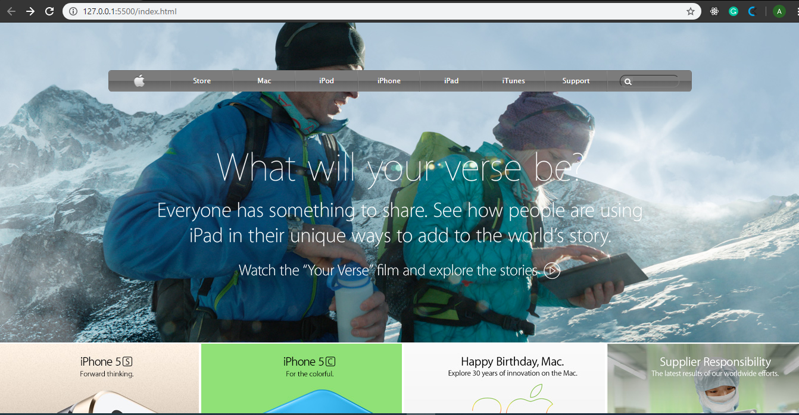

# apple-clone
Apple page clone to demonstrate created using floats, flex, background images and gradients.

# Screenshot

# Built with
- Html5
- CSS

# Note
For some reason that is unknown to me at present, the live demo doesn't load background images at all and all my images are background. I suggest you clone and run it on your machine to review it.

# Live Demo
[Live demo](https://rawcdn.githack.com/asiimwedismas/apple-clone/34baa0092ac20d08f14d979a3556bfdfe4d3f19a/index.html)

# Authors
 Dismas Asiimwe
 - Github: [@asiimwedismas](https://github.com/asiimwedismas)
 - Linkedin: [@asiimwedismas](https://www.linkedin.com/in/asiimwedismas/)
 - Twitter: [@asiimwedismas](https://www.twitter.com/asiimwedismas)